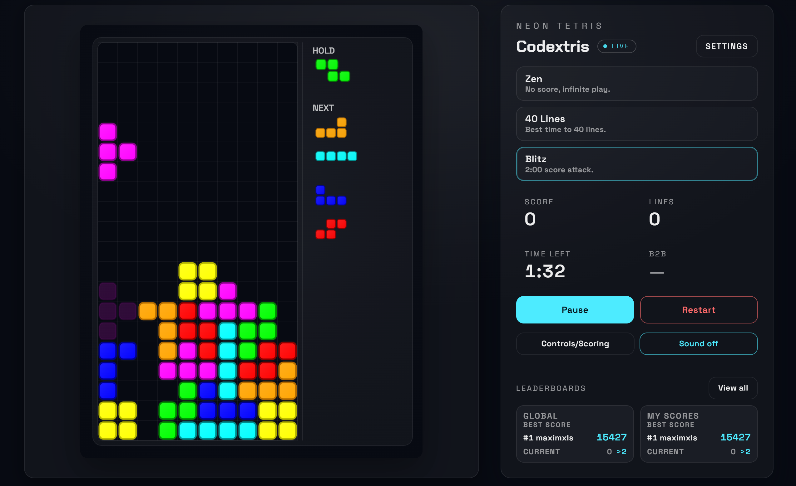

# Vibecoded tetris
Not a single line of code was written by me. Everything was written by gpt-5.2-codex under my guidance.

You can play here: [codextris.xls.msk.ru](https://codextris.xls.msk.ru/)



# Codextris — Neon Tetris

Codextris is a neon-styled, keyboard-first Tetris built with SvelteKit + TypeScript. It uses a deterministic fixed-timestep loop, configurable handling presets, and a canvas renderer tuned for crisp, responsive play.

## Features
- Smooth fixed-timestep gameplay loop with deterministic updates.
- Handling presets (Slow, Classic, Fast, Finesse) plus custom tuning.
- Combo and back-to-back scoring with on-screen feedback.
- Pause/resume countdown, overlays, and keyboard hints.
- Optional audio with a visible mute toggle.
- Docker dev and production flows.

## Quick start
```bash
npm install
npm run dev
```
Open the dev server at the default Vite address.

## Leaderboards (Cloudflare Workers + D1)
Setup steps for D1, Wrangler, and Worker deployment are in `CLOUDFLARE.md`.

## Controls
- Move: Left / Right arrow
- Rotate (CW): Up arrow or X
- Rotate (CCW): Z
- Rotate 180: A
- Soft drop: Down arrow
- Hard drop: Space
- Hold: C / Shift
- Pause: P or Esc
- Restart: R
- Start (menu): Enter

## Handling presets
- **Slow**: relaxed DAS/ARR and a softer soft drop.
- **Classic**: balanced, guideline-inspired defaults.
- **Fast**: snappier DAS/ARR and quicker soft drop.
- **Finesse**: instant ARR for fast lateral control.

## Scoring
- Singles / Doubles / Triples / Tetris use standard line scores.
- T-spins use a separate score ladder.
- Combos add a bonus per chain and scale by level.
- Back-to-back clears apply a multiplier.

The exact values are defined in `src/lib/game/types.ts` (`DEFAULT_RULES`).

## Project structure
- `src/`: SvelteKit app source.
- `src/routes/`: UI routes (`+page.svelte`, `debug/+page.svelte`).
- `src/lib/game/`: Core game logic (state, update, scoring, render helpers).
- `tests/`: Vitest unit tests.

## Development & build
```bash
npm run dev
npm run build
npm run preview
```

For Cloudflare Workers + D1 local testing:
```bash
npm run build
npx wrangler dev .svelte-kit/cloudflare
```

## Docker
```bash
docker compose up dev
```
```bash
docker compose up prod
```
Note: the production container targets a static build (legacy). Cloudflare Workers deploys via `wrangler`.

## Tests
```bash
npm test
```

## Extending with new modes
The core loop supports rule injection (scoring ladders, combo and B2B multipliers, and basic rule toggles) via `GameRules`. New modes can supply alternate rules and configs without changing rendering or input handling. Mode selection UI is wired in `src/routes/+page.svelte`.

## License
MIT. See `LICENSE`.
